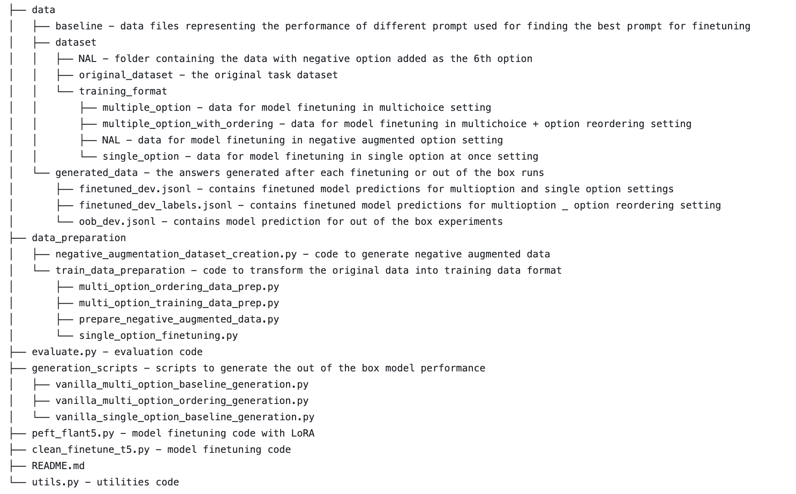

# anlp_assignment4

# Code and Folder Descriptions:

# *Setup the environment:*

pip install "transformers==4.27.1" "datasets==2.9.0" "accelerate==0.17.1" "evaluate==0.4.0" "bitsandbytes==0.37.1" loralib --upgrade --quiet
pip install -q pytorch_lightning
pip install -q sentencepiece
pip install -q jsonlines
pip install "peft==0.2.0"
pip install tensorboard py7zr

*Make sure that the dataset is present in dataset/{train, dev, test}.jsonl*

- Execute the following commands to run the baseline model:

python ./generation_scripts/*.py
python evaluate.py (replace the filenames in the main method)

- Execute the following commands to run the finetuning code:
python clean_fine_tune_t5.py

- For executing the finetuning code with the reordering enabled:
python clean_fine_tune_t5.py reorder

- Execute the following commands to run the LoRa finetuning code:
python peft_flant5.py

- For executing the lora finetuning code with the reordering enabled:
python peft_flant5.py reorder
